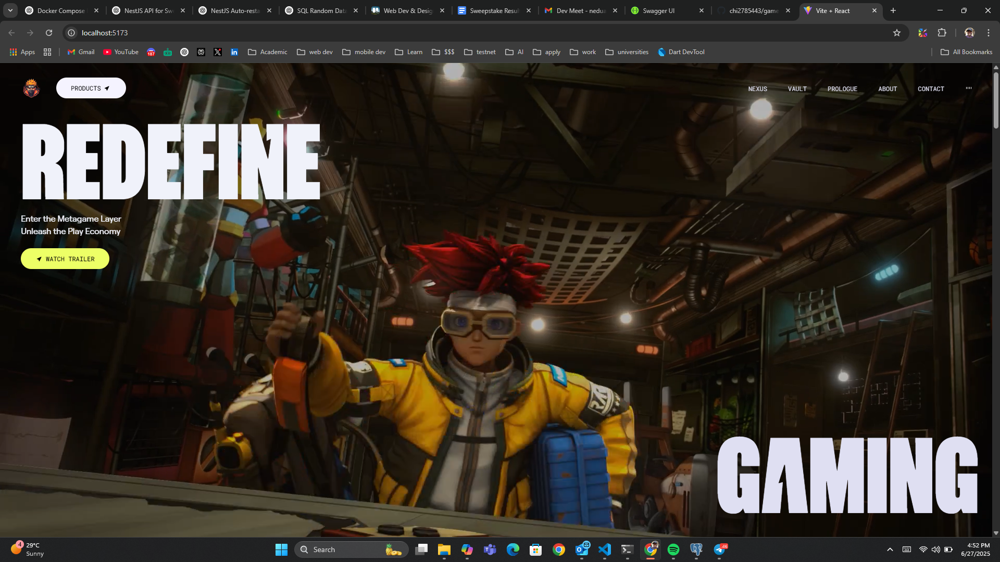
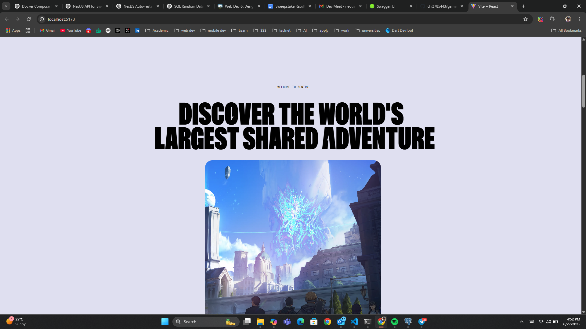
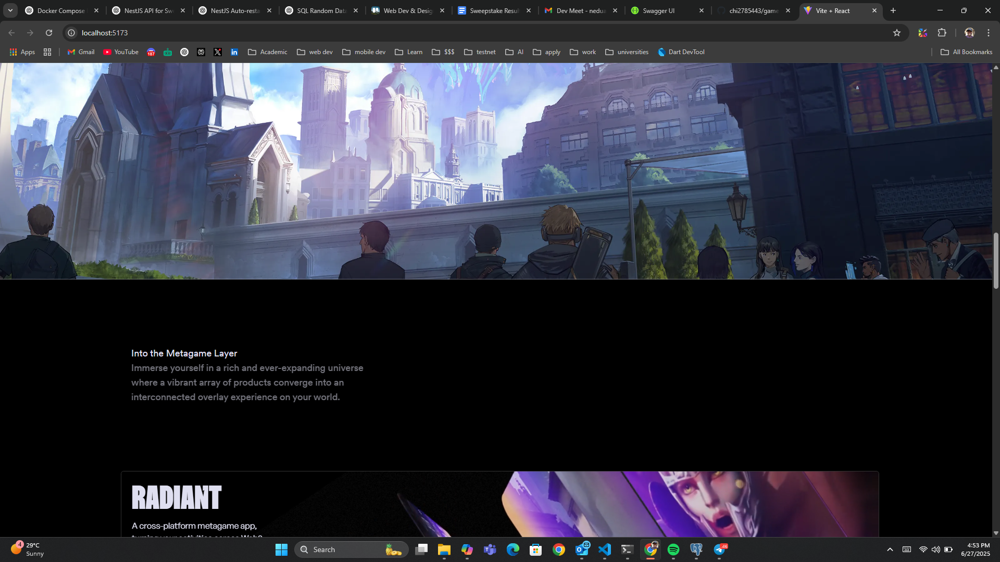
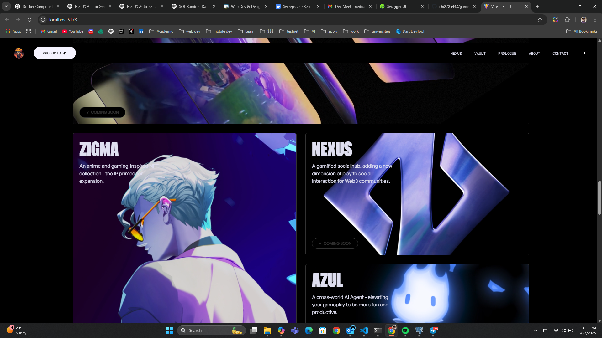
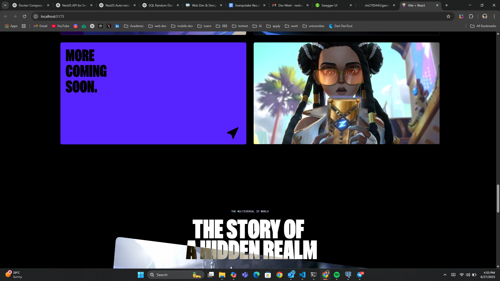
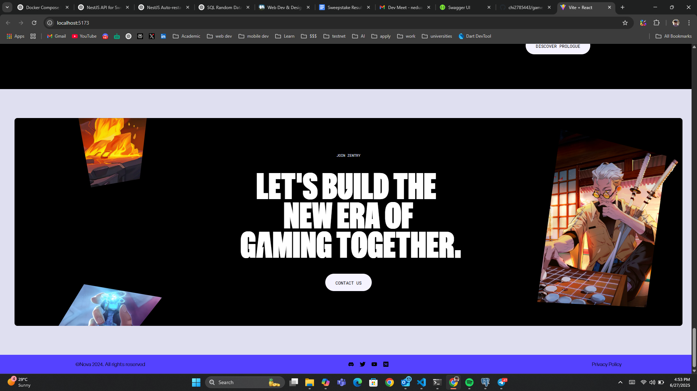

```markdown
# 🎮 GameHub

**GameHub** is a web-based gaming platform built with **React** and **JavaScript**, offering users a collection of classic mini-games with an intuitive interface, smooth performance, and responsive design. It’s ideal for casual play, learning, or just killing time.

---

## 📸 Screenshots

<div align="center">
  
  
  
  
  
  
  
</div>

---

## 🚀 Features

- 🎲 **Classic Games** – Enjoy games like Tic Tac Toe, Snake, and Memory Match.
- ⚡ **Smooth Gameplay** – Built with React for optimized performance and reactivity.
- 🎮 **State Management** – Game states and scores managed using React hooks.
- 🎨 **Responsive UI** – Play from your phone, tablet, or desktop.
- 🔊 **Sound Effects** – Optional SFX for immersive gameplay (toggleable).
- 📈 **Score Tracking** – Track personal high scores across sessions (localStorage).

---

## 🧱 Tech Stack

| Technology   | Purpose                              |
|--------------|--------------------------------------|
| React        | Component-based UI framework         |
| JavaScript   | Game logic and interactivity         |
| HTML5/CSS3   | Layout and styling                   |
| React Router | Page/game navigation (if needed)     |
| localStorage | Storing user scores and preferences  |

---

## 📁 Project Structure

```

gamehub/
├── public/
│   └── index.html
├── src/
│   ├── components/
│   │   ├── Navbar.jsx
│   │   ├── GameCard.jsx
│   │   └── Footer.jsx
│   ├── games/
│   │   ├── TicTacToe.jsx
│   │   ├── Snake.jsx
│   │   └── MemoryMatch.jsx
│   ├── utils/
│   │   └── gameHelpers.js
│   ├── styles/
│   │   └── App.css
│   ├── App.jsx
│   └── index.js

````

---

## ✅ Getting Started

### Prerequisites

- Node.js and npm installed
- Git or GitHub CLI (optional)

### Run Locally

```bash
git clone https://github.com/your-username/gamehub.git
cd gamehub
npm install
npm start
````

Open your browser and visit: `http://localhost:3000`

---


## 🙋‍♂️ Author

**Chinedu Aguwa**
Civil Engineer | Software Developer | AI Enthusiast
📧 [neduaguwa443@gmail.com](mailto:neduaguwa443@gmail.com)
🔗 [LinkedIn](https://www.linkedin.com/in/chinedu-aguwa)
💻 [GitHub](https://github.com/chi2785443)

---

## 💬 Contributing

Contributions are welcome! Feel free to fork this repo and open a pull request with your improvements or fixes.

---

## 📄 License

This project is licensed under the **MIT License** – see the [LICENSE](LICENSE) file for details.

---
